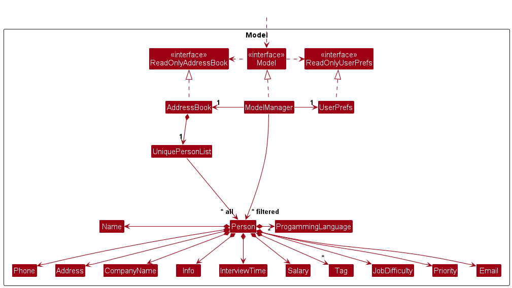
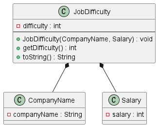

* Table of Contents
{:toc}

--------------------------------------------------------------------------------------------------------------------

## **Acknowledgements**

* {list here sources of all reused/adapted ideas, code, documentation, and third-party libraries -- include links to the original source as well}

--------------------------------------------------------------------------------------------------------------------

## **Setting up, getting started**

Refer to the guide [_Setting up and getting started_](SettingUp.md).

--------------------------------------------------------------------------------------------------------------------

## **Design**

:bulb: **Tip:** The `.puml` files used to create diagrams in this document `docs/diagrams` folder. Refer to the [_PlantUML Tutorial_ at se-edu/guides](https://se-education.org/guides/tutorials/plantUml.html) to learn how to create and edit diagrams.

### Architecture

The ***Architecture Diagram*** given above explains the high-level design of the App.

Given below is a quick overview of main components and how they interact with each other.

**Main components of the architecture**

**`Main`** (consisting of classes [`Main`](https://github.com/se-edu/addressbook-level3/tree/master/src/main/java/seedu/address/Main.java) and [`MainApp`](https://github.com/se-edu/addressbook-level3/tree/master/src/main/java/seedu/address/MainApp.java)) is in charge of the app launch and shut down.
* At app launch, it initializes the other components in the correct sequence, and connects them up with each other.
* At shut down, it shuts down the other components and invokes cleanup methods where necessary.

The bulk of the app's work is done by the following four components:

* [**`UI`**](#ui-component): The UI of the App.
* [**`Logic`**](#logic-component): The command executor.
* [**`Model`**](#model-component): Holds the data of the App in memory.
* [**`Storage`**](#storage-component): Reads data from, and writes data to, the hard disk.

[**`Commons`**](#common-classes) represents a collection of classes used by multiple other components.

**How the architecture components interact with each other**

The *Sequence Diagram* below shows how the components interact with each other for the scenario where the user issues the command `delete 1`.

Each of the four main components (also shown in the diagram above),

* defines its *API* in an `interface` with the same name as the Component.
* implements its functionality using a concrete `{Component Name}Manager` class (which follows the corresponding API `interface` mentioned in the previous point.

For example, the `Logic` component defines its API in the `Logic.java` interface and implements its functionality using the `LogicManager.java` class which follows the `Logic` interface. Other components interact with a given component through its interface rather than the concrete class (reason: to prevent outside component's being coupled to the implementation of a component), as illustrated in the (partial) class diagram below.

The sections below give more details of each component.

### UI component

The **API** of this component is specified in [`Ui.java`](https://github.com/se-edu/addressbook-level3/tree/master/src/main/java/seedu/address/ui/Ui.java)

The UI consists of a `MainWindow` that is made up of parts e.g.`CommandBox`, `ResultDisplay`, `PersonListPanel`, `StatusBarFooter` etc. All these, including the `MainWindow`, inherit from the abstract `UiPart` class which captures the commonalities between classes that represent parts of the visible GUI.

The `UI` component uses the JavaFx UI framework. The layout of these UI parts are defined in matching `.fxml` files that are in the `src/main/resources/view` folder. For example, the layout of the [`MainWindow`](https://github.com/se-edu/addressbook-level3/tree/master/src/main/java/seedu/address/ui/MainWindow.java) is specified in [`MainWindow.fxml`](https://github.com/se-edu/addressbook-level3/tree/master/src/main/resources/view/MainWindow.fxml)

The `UI` component,

* executes user commands using the `Logic` component.
* listens for changes to `Model` data so that the UI can be updated with the modified data.
* keeps a reference to the `Logic` component, because the `UI` relies on the `Logic` to execute commands.
* depends on some classes in the `Model` component, as it displays `Person` object residing in the `Model`.

### Logic component

**API** : [`Logic.java`](https://github.com/se-edu/addressbook-level3/tree/master/src/main/java/seedu/address/logic/Logic.java)

Here's a (partial) class diagram of the `Logic` component:

The sequence diagram below illustrates the interactions within the `Logic` component, taking `execute("delete 1")` API call as an example.

:information_source: **Note:** The lifeline for `DeleteCommandParser` should end at the destroy marker (X) but due to a limitation of PlantUML, the lifeline continues till the end of diagram.

How the `Logic` component works:

1. When `Logic` is called upon to execute a command, it is passed to an `AddressBookParser` object which in turn creates a parser that matches the command (e.g., `DeleteCommandParser`) and uses it to parse the command.
1. This results in a `Command` object (more precisely, an object of one of its subclasses e.g., `DeleteCommand`) which is executed by the `LogicManager`.
1. The command can communicate with the `Model` when it is executed (e.g. to delete a person). 
   Note that although this is shown as a single step in the diagram above (for simplicity), in the code it can take several interactions (between the command object and the `Model`) to achieve.
1. The result of the command execution is encapsulated as a `CommandResult` object which is returned back from `Logic`.

Here are the other classes in `Logic` (omitted from the class diagram above) that are used for parsing a user command:

How the parsing works:
* When called upon to parse a user command, the `AddressBookParser` class creates an `XYZCommandParser` (`XYZ` is a placeholder for the specific command name e.g., `AddCommandParser`) which uses the other classes shown above to parse the user command and create a `XYZCommand` object (e.g., `AddCommand`) which the `AddressBookParser` returns back as a `Command` object.
* All `XYZCommandParser` classes (e.g., `AddCommandParser`, `DeleteCommandParser`, ...) inherit from the `Parser` interface so that they can be treated similarly where possible e.g, during testing.

### Model component
**API** : [`Model.java`](https://github.com/se-edu/addressbook-level3/tree/master/src/main/java/seedu/address/model/Model.java)

The `Model` component,

* stores the address book data i.e., all `Person` objects (which are contained in a `UniquePersonList` object).
* stores the currently 'selected' `Person` objects (e.g., results of a search query) as a separate _filtered_ list which is exposed to outsiders as an unmodifiable `ObservableList<Person>` that can be 'observed' e.g. the UI can be bound to this list so that the UI automatically updates when the data in the list change.
* stores a `UserPref` object that represents the user’s preferences. This is exposed to the outside as a `ReadOnlyUserPref` objects.
* does not depend on any of the other three components (as the `Model` represents data entities of the domain, they should make sense on their own without depending on other components)

:information_source: **Note:** An alternative (arguably, a more OOP) model is given below. It has a `Tag` list in the `AddressBook`, which `Person` references. This allows `AddressBook` to only require one `Tag` object per unique tag, instead of each `Person` needing their own `Tag` objects. 

### Storage component

**API** : [`Storage.java`](https://github.com/se-edu/addressbook-level3/tree/master/src/main/java/seedu/address/storage/Storage.java)

The `Storage` component,
* can save both address book data and user preference data in JSON format, and read them back into corresponding objects.
* inherits from both `AddressBookStorage` and `UserPrefStorage`, which means it can be treated as either one (if only the functionality of only one is needed).
* depends on some classes in the `Model` component (because the `Storage` component's job is to save/retrieve objects that belong to the `Model`)

### Common classes

Classes used by multiple components are in the `seedu.addressbook.commons` package.

--------------------------------------------------------------------------------------------------------------------

## **Implementation**

This section describes some noteworthy details on how certain features are implemented.

### Sorting contact list

This feature allows users to sort their addressbook based on various information, namely, name, company
name, interview time, salary and priority. This feature leverages on the built-in `ObservableList` provided by JavaFX.
The sorting is done by creating classes that implements the Comparator<T> interface.
* `PersonCompanyNameComparator.java`
* `PersonInterviewTimeComparator.java`
* `PersonNameComparator.java`
* `PersonPriorityComparator.java`
* `PersonSalaryComparator.java`

These comparators are referenced in the `SortCommandParser`. In the `SortCommandParser` each comparator will be assigned
a static integer based on the CLI Syntax from the userInput. The string is that parsed and assigned an integer from 
**1 - 4** which are pre-assigned to a comparator.

#### Overview of SortCommand
 
Based on the image above:
* Step 1: User inputs `sort pri/` which calls the `execute()` function in the `LogicManager` object.
  * `pri/` is an added CLI Syntax to refer to priority which is an added attribute to `Person` class.
* Step 2: `LogicManager` calls the `parseCommand()` function in `AddressBookParser` object which interprets the `sort`
  command word and creates a `SortCommandParser` object.
* Step 3: The `SortCommandParser` object then parses `pri/` and create the `SortCommand` object.
  * `SortCommand` constructor takes in an **Integer**  and `SortCommandParser` already pre-assigns `pri/` to 0.
* Step 4: `LogicManager` then executes the command.
* Step 5: `SortCommand` will call `updateSortedPersonList()` from the `Model` object which has a reference to the
`AddressBook` which contains the `UniquePersonList` object. The `UniquePersonList` then sorts it based on the
comparator.

### Job Difficulty Feature

#### Overview
The job difficulty feature allows program auto calculate a difficulty score for a job 
based on the company name and salary. 
This feature leverages on the local storage of 
famous company names and their job difficulty levels.  

#### Class Structure
The `JobDifficulty` class is responsible for calculating the 
job difficulty score. It uses the `CompanyName` and `Salary` classes 
to retrieve the necessary information.

#### Method Details
`JobDifficulty(CompanyName companyName, Salary salary)`  
This is the constructor for the JobDifficulty class. 
It takes in a CompanyName object and a Salary object. 
It retrieves the difficulty level of the company and adds 
it to the salary to calculate the job difficulty score.

`getDifficulty()`  
This method returns the calculated job difficulty score

### Filtering of list by interview time, tags, salary range, and programming languages feature
This feature allows users to filter their lists according to the interview time range, tags, salary range 
and programming language.

#### Implementation
The `FilterCommand` class is an abstract class inherited by concrete classes, `FilterInterviewTimeCommand`, 
`FilterTagCommand`, `FilterSalaryCommand` and `FilterProgrammingLanguageCommand` which will filter the list 
according to their respective categories. 

**Process:**
1. FilterCommandParser class will determine a concrete subclass of FilterCommand to be returned.
2. The concrete FilterCommandClass will check if their respective categories (interview times, tags, etc.) in the 
   contact list contain the keyword
3. Return the list of contacts which contain the keyword

--------------------------------------------------------------------------------------------------------------------

## **Documentation, logging, testing, configuration, dev-ops**

* [Documentation guide](Documentation.md)
* [Testing guide](Testing.md)
* [Logging guide](Logging.md)
* [Configuration guide](Configuration.md)
* [DevOps guide](DevOps.md)

--------------------------------------------------------------------------------------------------------------------

## **Appendix: Requirements**

### Product scope

**Target user profile**:

* computing professionals looking for job openings
* has a need to manage a significant number of company contacts
* prefer desktop apps over other types
* can type fast
* prefers typing to mouse interactions
* is reasonably comfortable using CLI apps

**Value proposition**: User will be able to manage and schedule interview contacts, timings and job listings from a 
centralised location. Also manage contacts faster than a typical mouse/GUI driven app

### User stories

Priorities: High (must have) - `* * *`, Medium (nice to have) - `* *`, Low (unlikely to have) - `*`

| Priority | As a …​                     | I want to …​                                     | So that I can…​                                                    |
|----------|-----------------------------|--------------------------------------------------|--------------------------------------------------------------------|
| `* * *`  | Computer science job seeker | delete features                                  | delete information where necessary                                 |
| `* * *`  | Computer science job seeker | add contact information of interviewer / company | contact the interviewer / company                                  |
| `* * *`  | Computer science job seeker | add salary range                                 | check the salary range of the job                                  |
| `* * *`  | Computer science job seeker | add company name                                 | check which company the job is from                                |
| `* * *`  | Computer science job seeker | add extra info about the company                 | recall the extra information about each of the companies           |                   |
| `* * *`  | Computer science job seeker | add interview time                               | check what is the interview time                                   |
| `* *`    | Computer science job seeker | add programming language(s) related to the job   | identify which programming language(s) is/are required for the job |
| `* *`    | Computer science job seeker | add job responsibilities                         | check what are the job responsibilities for the job                |
| `* *`    | Computer science job seeker | categorise job postings according to industry    | filter information based on the different types of industries      |
| `*`      | Computer science job seeker | receive notifications when I get a new interview | stay up-to-date with the interview offers and attend them          |
| `*`      | Computer science job seeker | track the status of my job application           | follow up with any actions when necessary                          |
| `*`      | Computer science job seeker | receive reminders for my interview timings       | be reminded about the interview                                    |

### Use cases

(For all use cases below, the **System** is the `AddressBook` and the **Actor** is the `user`, unless specified otherwise)

---

**Use case: Delete a person**

**MSS**

1.  User requests to list persons
2.  AddressBook shows a list of persons
3.  User requests to delete a specific person in the list
4.  AddressBook deletes the person

    Use case ends.

**Extensions**

* 2a. The list is empty.

  Use case ends.

* 3a. The given index is invalid.

    * 3a1. AddressBook shows an error message.

      Use case resumes at step 2.

---

**Use case: Add a Contact with Detailed Information**

**MSS**

1. The user decides to add a new contact to their address book.
2. The user inputs the add command followed by the contact's details in the format: add n/NAME p/PHONE_NUMBER e/EMAIL a/ADDRESS [t/TAG]….
3. CCBot validates the input details.
4. CCBot adds the new contact to the address book, assigning it a unique identifier within the system.
5. CCBot displays a confirmation message to the user indicating the successful addition of the new contact.

      Use case ends.

**Extensions**

* 3a. If the user enters invalid details (e.g., incorrect format, missing mandatory fields like name or phone number):
   * 3a1. CCBot shows an error message indicating the validation failure and the correct format of the command.

      Use case resumes at step 2.
*a. At any time, User chooses to cancel the addition.
    *a1.  CCBot requests to confirm cancellation
    *a2. User confirms the cancellation
    Use case ends.
---

**Use case: Add Salary Range to a Contact**

**MSS**

1. The user decides to add a new contact with the salary or salary range info to their address book.
2. User inputs the 'add' command with the salary detail in the correct format.
3. CCBot validates the salary format and range.
4. CCBot adds or updates the salary information for the contact and displays a success message.

      Use case ends.

**Extensions**

* 3a. If the salary detail is invalid:
   * 3a1. CCBot shows an error message indicating the validation failure and the correct format of the command.

      Use case resumes at step 2.

---

**Use case: Add the Company’s Name to a Contact**

**MSS**

1. The user decides to add a new contact with the company’s name info to their address book.
2. User inputs the 'add' command with the company’s name in the correct format.
3. CCBot validates the salary format and range.
4. CCBot adds or updates the company’s name information for the contact and displays a success message.

      Use case ends.

**Extensions**

* 3a. If the company’s name is bigger than 100 characters:
   * 3a1. CCBot shows an error message indicating the validation failure and the limit characters number.

      Use case resumes at step 2.

---

**Use case: Add Programming Language to a Contact**

**MSS**

1. The user decides to add a new contact with the programming language  info to their address book.
2. User inputs the 'add' command with the programming language detail in the correct format.
3. CCBot validates the salary format and range.
4. CCBot adds or updates the programming language information for the contact and displays a success message.

      Use case ends.

**Extensions**

* 3a. If the  programming language detail is invalid:
   * 3a1. CCBot shows an error message indicating the validation failure and an error message about the format or character limit.

      Use case resumes at step 2.

---

**Use case: Add extra info about the company to a Contact**

**MSS**

1. The user decides to add a new contact with extra company info to their address book.
2. User inputs the 'add' command with the extra information detail in the correct format.
3. CCBot validates the input details.
4. CCBot adds or updates the extra information for the contact and displays a success message.

   Use case ends.

**Extensions**

* 3a. If the  extra information detail is invalid:
    * 3a1. CCBot shows an error message indicating the validation failure and an error message about the format or character limit.

      Use case resumes at step 2.

---

### Non-Functional Requirements

1.  Should work on any _mainstream OS_ as long as it has Java `11` or above installed.
2.  Should be able to hold up to 1000 persons without a noticeable sluggishness in performance for typical usage.
3.  A user with above average typing speed for regular English text (i.e. not code, not system admin commands) should be able to accomplish most of the tasks faster using commands than using the mouse.
4.  User Interface should be intuitive enough for users to easily add interview dates and salaries.
5.  System should be able to cater to various date formats given by users.
6.  System should be able to handle a minimum of 100 contacts

*{More to be added}*

### Glossary

* **Computer Science job seeker** : Student / Unemployed / Working adult seeking employment opportunities in the field of Computer Science
* **Mainstream OS**: Windows, Linux, Unix, MacOS
* **Private contact detail**: A contact detail that is not meant to be shared with others 

--------------------------------------------------------------------------------------------------------------------

## **Appendix: Instructions for manual testing**

Given below are instructions to test the app manually.

:information_source: **Note:** These instructions only provide a starting point for testers to work on;
testers are expected to do more *exploratory* testing.

### Launch and shutdown

1. Initial launch

   1. Download the jar file and copy into an empty folder

   1. Double-click the jar file Expected: Shows the GUI with a set of sample contacts. The window size may not be optimum.

1. Saving window preferences

   1. Resize the window to an optimum size. Move the window to a different location. Close the window.

   1. Re-launch the app by double-clicking the jar file. 
       Expected: The most recent window size and location is retained.

1. _{ more test cases …​ }_

### Deleting a person

1. Deleting a person while all persons are being shown

   1. Prerequisites: List all persons using the `list` command. Multiple persons in the list.

   1. Test case: `delete 1` 
      Expected: First contact is deleted from the list. Details of the deleted contact shown in the status message. Timestamp in the status bar is updated.

   1. Test case: `delete 0` 
      Expected: No person is deleted. Error details shown in the status message. Status bar remains the same.

   1. Other incorrect delete commands to try: `delete`, `delete x`, `...` (where x is larger than the list size) 
      Expected: Similar to previous.

1. _{ more test cases …​ }_

### Saving data

1. Dealing with missing/corrupted data files

   1. _{explain how to simulate a missing/corrupted file, and the expected behavior}_

1. _{ more test cases …​ }_
--------------------------------------------------------------------------------------------------------------------
## **Appendix: Planned Enhancements**

Team size: 5
1. **Have an error message show up when the data file is corrupted on startup**: The current address book simply starts
up with an empty list when the data in the json file is corrupted or has an invalid format. The current implementation
has a logger warning shown in the developer console, but not the app itself. We plan have an error message show up on
results display after startup of the app when the data is corrupted.

2. **Allow `filter` command to filter the contact list based on a combination of categories**: The current `filter`
command only allows the contact list to be filtered based on one specific category such as tags, salary range etc
and this may not be useful for users with a very huge number of contacts as filtering by only one category may still
return a long list. It is also not convenient for users who want to find contacts more specifically. We plan to
allow `filter` to filter the contact list more specifically. (e.g. `filter t/TAG s/SALARY_RANGE` will return
contacts with matching `TAG` and `SALARY_RANGE` that falls within what is specified)

3**Store** the resume such that

