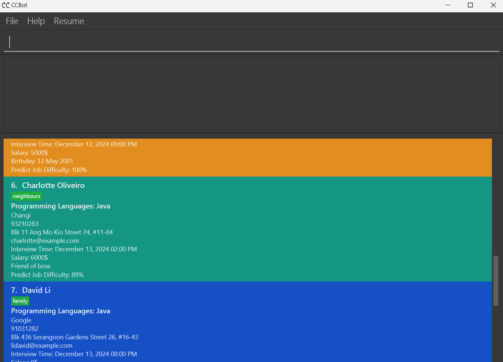
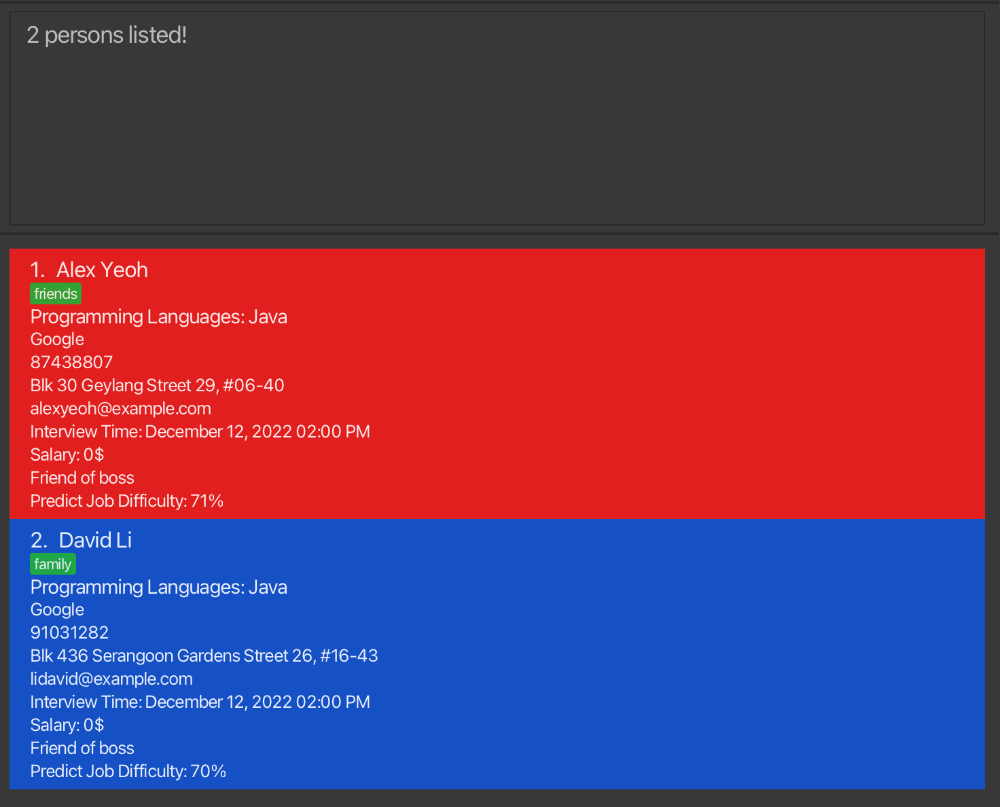

Career Connect Bot (CCBot) is a **desktop app for managing job interview contacts, optimized for use via a Command Line
Interface**
(CLI) while still having the benefits of a Graphical User Interface (GUI). If you can type fast, CCBot can get your
contact management tasks done faster than traditional GUI apps.

* Table of Contents
{:toc}

--------------------------------------------------------------------------------------------------------------------

## Quick start

1. Ensure you have Java `11` or above installed in your Computer.

1. Download the latest `CCBOT.jar` from [here](https://github.com/AY2324S2-CS2103T-T08-3/tp/releases).

1. Copy the file to the folder you want to use as the _home folder_ for your AddressBook.

1. Open a command terminal, `cd` into the folder you put the jar file in, and use the `java -jar CCBOT.jar` command to run the application. 
   A GUI similar to the below should appear in a few seconds. Note how the app contains some sample data. 
   

1. Type the command in the command box and press Enter to execute it. e.g. typing **`help`** and pressing Enter will open the help window. 
   Some example commands you can try:

   * `list` : Lists all contacts.

   * `add cn/Google n/John Doe p/98765432 e/johnd@example.com a/311, Clementi Ave 2, #02-25 tt/121220221400
     i/remote work s/5000 pl/Java t/friends t/referral pri/2` :
     Adds a contact named `John Doe` to the Address Book.

   * `delete 3` : Deletes the 3rd contact shown in the current list.

   * `clear` : Deletes all contacts.

   * `exit` : Exits the app.

1. Refer to the [Features](#features) below for details of each command.

--------------------------------------------------------------------------------------------------------------------
## Priority
>From 0-4 our program has 5 priorities. The lower the value, the higher the priority.

**0 - High Priority** - This is the highest priority.

**1 - Medium Priority** - This is the second highest priority.

**2 - Low Priority** - This is the third highest priority.

**3 - Very Low Priority** - This is the fourth highest priority.

**4 - Lowest Priority** - This is the lowest priority.

--------------------------------------------------------------------------------------------------------------------

## Features

**:information_source: Notes about the command format:** 

* Words in `UPPER_CASE` are the parameters to be supplied by the user. 
  e.g. in `add n/NAME`, `NAME` is a parameter which can be used as `add n/John Doe`.

* Items in square brackets are optional. 
  e.g `n/NAME [t/TAG]` can be used as `n/John Doe t/friend` or as `n/John Doe`.

* Items with `…`​ after them can be used multiple times including zero times. 
  e.g. `[t/TAG]…​` can be used as ` ` (i.e. 0 times), `t/friend`, `t/friend t/family` etc.

* Parameters can be in any order. 
  e.g. if the command specifies `n/NAME p/PHONE_NUMBER`, `p/PHONE_NUMBER n/NAME` is also acceptable.

* Extraneous parameters for commands that do not take in parameters (such as `help`, `list`, `exit` and `clear`) will be ignored. 
  e.g. if the command specifies `help 123`, it will be interpreted as `help`.

* If you are using a PDF version of this document, be careful when copying and pasting commands that span multiple lines as space characters surrounding line-breaks may be omitted when copied over to the application.

### Viewing help : `help`

Shows a message explaining how to access the help page.

Format: `help`

### Adding a person: `add`

Adds a person to the address book.

Format: `add cn/COMPANY_NAME n/NAME p/PHONE_NUMBER e/EMAIL a/ADDRESS [tt/INTERVIEW-TIME] [i/INFO]
        [s/SALARY] [pl/PROGRAMMING-LANGUAGE] [t/TAG] [pri/PRIORITY(0-4)] …​`

:bulb: **Tip:**
A person can have any number of tags (including 0)

Examples:
* `add cn/Google n/John Doe p/98765432 e/johnd@example.com a/311, Clementi Ave 2, #02-25 tt/121220221400
i/Birthday: 12 May 2001 s/5000 pl/Java t/friends t/owesMoney pri/2`
* `add cn/ Amazon n/Betsy Crowe p/81234567 e/betsycrowe@example.com a/Newgate Prison tt/121220241200
i/Remote work s/4000 pl/Python t/criminal pri/4`

#### Constraint
* The `COMPANY_NAME` should be less than 100 chracters, and it should not be blank.
* The `NAME` should only contain alphanumeric characters and spaces, and it should not be blank.
* The `PHONE_NUMBER` should only contain numbers, and it should be at least 3 digits long.
* The `EMAIL` should be a valid email address.
* The `ADDRESS` can take any values, and it should not be blank.
* The `SALARY` should only contain numbers, with range [0, 2147483647] or two pure digital numbers with '-' in between. Both digital numbers should be within the range [0, 2147483647].
* The `PROGRAMMING_LANGUAGE` should be alphanumeric and may contain some special characters (+ and #), and must be less than 50 characters.
* The `TAG` should be alphanumeric.
* The `PRIORITY` should be a number between 0 and 4.
* The `INTERVIEW_TIME` should be in the format `ddMMyyyyHHmm`.
* The `INFO` can take any values, and it should not be blank.

### Adding a resume: `resume`

Adds a resume to the addressbook.

Format: `resume cn/COMPANY_NAME n/NAME p/PHONE_NUMBER a/ADDRESS e/EMAIL s/SALARY edu/EDUCATION a/ADDRESS`

Examples:
* `resume cn/Google n/John Doe p/98765432 e/johnd@example.com s/3000 edu/NUS a/311, Clementi Ave 2, #02-25 pl/Java pl/C++`
* `resume cn/Apple n/Amy Birch p/87654321 e/amy@example.com s/3000 edu/NUS a/311, Clementi Ave 2, #02-25`

#### Constraint
* The `COMPANY_NAME` should be less than 100 chracters, and it should not be blank.
* The `NAME` should only contain alphanumeric characters and spaces, and it should not be blank.
* The `PHONE_NUMBER` should only contain numbers, and it should be at least 3 digits long.
* The `EMAIL` should be a valid email address.
* The `ADDRESS` can take any values, and it should not be blank.
* The `SALARY` should only contain numbers, with range [0, 2147483647] or two pure digital numbers with '-' in between. Both digital numbers should be within the range [0, 2147483647].
* The `EDUCATION` should only contain alphanumeric characters and spaces, and it should not be blank.

### Listing all persons : `list`

Shows a list of all persons in the address book.

Format: `list`

### Editing a person : `edit`

Edits an existing person in the address book.

Format: `edit INDEX [cn/COMPANY_NAME] [n/NAME] [p/PHONE_NUMBER] [e/EMAIL a/ADDRESS] [tt/INTERVIEW-TIME] [i/INFO]
[s/SALARY] [pl/PROGRAMMING-LANGUAGE] [t/TAG] [pri/PRIORITY(0-4)]…​`

* Edits the person at the specified `INDEX`. The index refers to the index number shown in the displayed person list. The index **must be a positive integer** 1, 2, 3, …​
* At least one of the optional fields must be provided.
* Existing values will be updated to the input values.
* When editing tags and info, the existing tags and info of the person will be removed i.e adding of tags and info are
  not cumulative.
  * You can remove all the person’s tags by typing `t/` without specifying any tags after it.
  * You can remove all the person’s info by typing `i/` without specifying any info after it.
Examples:
*  `edit 1 p/91234567 e/johndoe@example.com` Edits the phone number and email address of the 1st person to be `91234567` and `johndoe@example.com` respectively.
*  `edit 2 n/Betsy Crower t/` Edits the name of the 2nd person to be `Betsy Crower` and clears all existing tags.

#### Constraint
* The `COMPANY_NAME` should be less than 100 chracters, and it should not be blank.
* The `NAME` should only contain alphanumeric characters and spaces, and it should not be blank.
* The `PHONE_NUMBER` should only contain numbers, and it should be at least 3 digits long.
* The `EMAIL` should be a valid email address.
* The `ADDRESS` can take any values, and it should not be blank.
* The `SALARY` should only contain numbers, with range [0, 2147483647] or two pure digital numbers with '-' in between. Both digital numbers should be within the range [0, 2147483647].
* The `PROGRAMMING_LANGUAGE` should be alphanumeric and may contain some special characters (+ and #), and must be less than 50 characters.
* The `TAG` should be alphanumeric.
* The `PRIORITY` should be a number between 0 and 4.
* The `INTERVIEW_TIME` should be in the format `ddMMyyyyHHmm`.
* The `INFO` can take any values, and it should not be blank.

### Locating persons by name / company name: `find`

Finds persons whose names / company names contain any of the given keywords.

Format: `find KEYWORD [MORE_KEYWORDS]`

* The search is case-insensitive. e.g `hans` will match `Hans`
* The order of the keywords does not matter. e.g. `Hans Bo` will match `Bo Hans`
* Only name and company name is searched.
* Only full words will be matched e.g. `Han` will not match `Hans`
* Persons matching at least one keyword will be returned (i.e. `OR` search).
  e.g. `Hans Bo` will return `Hans Gruber`, `Bo Yang`

Examples:
* `find John` returns `John` and `John Doe`
* `find google` returns `google` and `Google`
* `find mary tiktok` returns `Mary Lee` and `Tiktok`
* `find alex david` returns `Alex Yeoh`, `David Li` 
  

### Locating persons by various categories: `filter`

Filters contact list based on tags, interview times, salary range, or programming languages.

#### Filter by tag: `filter t/`

Format: `filter t/TAG [MORE_TAGS]...`

* The search is case-sensitive.
* Only the tags of each of the contacts are searched.
* Persons matching at least one tag will be returned.

Examples:
* `filter t/manager` returns any persons with a tag, `manager`
* `filter t/manager HR` returns any persons with either of the tags, `manager` or `HR`.

#### Filter by interview times: `filter tt/`

Format: `filter tt/INTERVIEW_TIME_RANGE [MORE_INTERVIEW_TIME_RANGE]...`

* Only the interview times of each of the contacts are searched.
* Persons with interview times within the range provided will be returned.
* Valid `INTERVIEW_TIME_RANGE` includes:
  * `before/INTERVIEWTIME`
  * `after/INTERVIEWTIME`
  * `from/INTERVIEWTIME-INTERVIEWTIME`

Examples:
* `filter tt/before/010120200000 from/010120220000-010120230000` returns persons with interview times before 1 Jan
  2020, 1200am `(010120200000)` or persons with interview times within 1 Jan 2022, 1200am `(010120220000)` and 1 Jan
  2023, 1200am `(010120230000)`.
* `filter tt/after/010120220000` returns persons with interview times after 1 Jan 2022, 1200am `(010120220000)`.

#### Filter by salaries: `filter s/`

Format: `filter s/SALARY_RANGE [MORE_SALARY_RANGE]...`

* Only the salaries of each of the contacts are searched.
* Persons with salaries within the range provided will be returned.
* Valid `SALARY_RANGE` includes:
  * Valid `SALARY`
  * `>=INTEGER`
  * `<=INTEGER`

    where `INTEGER` is a number between 0 and 2147483647.

Examples:
* `filter s/5000` returns persons with salaries of $5000.
* `filter s/2000-5000 >=7000` returns persons with salaries that contain any number from $2000 to $5000 or with
  salaries more than or equals to $7000. (e.g. persons with salaries `3000-6000`, `4000`, `8000-20900` are returned).

#### Filter by programming language: `filter pl/`

Format `filter pl/PROGRAMMING_LANGUAGE [MORE_PROGRAMMING_LANGUAGE]...`

* The search is case-insensitive.
* Only the programming language of each of the contacts are searched.
* Persons matching at least one programming language will be returned.

Examples:
* `filter pl/Java` returns any persons with a programming language, `java`.
* `filter pl/python C` returns any persons with either of the programming languages, `python` or `c`.

### Sorting the person list : `sort`

Sorts the person list by the specified field.

Format: `sort [rev/] KEYWORD`

* Sorts the person list by the specified `KEYWORD`.
* The `KEYWORD` must be one of the following: `n/` (name), `cn/` (company name),`tt/` (interview time), `s/` (salary), `pri/` (priority).
* The `rev/` prefix can be added to sort in reverse order. (Optional)
* The sorting is not case-insensitive.
* The sort command defaults to alphabetical sorting for names and company names.
* The sort command defaults to chronological sorting for interview times.
* The sort command defaults to sort from largest to smallest for salary.
* The sort command defaults to sort from the highest priority to the lowest priority for priority.

Examples:
* `sort n/` sorts the person list by name in alphabetical order.
* `sort rev/ s/` sorts the person list by salary in descending order.
* `sort tt/` sorts the person list by interview time in chronological order.
* `sort rev/ pri/` sorts the person list by priority in descending order.
* `sort cn/` sorts the person list by company name in alphabetical order.
* `sort rev/ cn/` sorts the person list by company name in reverse alphabetical order.
* `sort rev/ tt/` sorts the person list by interview time in reverse chronological order.

### Deleting a person/persons: `delete`

Deletes the contact list based index or tags.

#### Delete by index: `delete`

Deletes the specified person from the address book.

Format: `delete INDEX`

* Deletes the person at the specified `INDEX`.
* The index refers to the index number shown in the displayed person list.
* The index **must be a positive integer** 1, 2, 3, …​

Examples:
* `list` followed by `delete 2` deletes the 2nd person in the address book.
* `find Betsy` followed by `delete 1` deletes the 1st person in the results of the `find` command.

#### Delete by tag: `delete t/`

Format: `delete t/TAG [MORE_TAGS]...`

* The search is case-insensitive.
* Only the tags of each of the contacts are deleted.
* Persons matching at least one tag will be deleted.

Examples:
* `delete t/manager` deletes any persons with a tag, `manager`
* `delete t/manager HR` deletes any persons with either of the tags, `manager` or `HR`.

### Clearing all entries : `clear`

Clears all entries from the address book.

Format: `clear`

### Exiting the program : `exit`

Exits the program.

Format: `exit`

### Saving the data

AddressBook data are saved in the hard disk automatically after any command that changes the data. There is no need to save manually.

### Editing the data file

AddressBook data are saved automatically as a JSON file `[JAR file location]/data/addressbook.json`. Advanced users are welcome to update data directly by editing that data file.

:exclamation: **Caution:**
If your changes to the data file makes its format invalid, AddressBook will discard all data and start with an empty data file at the next run. Hence, it is recommended to take a backup of the file before editing it. 
Furthermore, certain edits can cause the AddressBook to behave in unexpected ways (e.g., if a value entered is outside of the acceptable range). Therefore, edit the data file only if you are confident that you can update it correctly.

### Job difficulty
The job difficulty is automatically generated by our self-developed algorithm with an evaluation factor ranging from 0% to 100%. A higher value means that the algorithm guesses the difficulty or competition of getting the job.

This value cannot be modified or added by the `edit` or `add` commands.

--------------------------------------------------------------------------------------------------------------------

## FAQ

**Q**: How do I transfer my data to another Computer? 
**A**: Install the app in the other computer and overwrite the empty data file it creates with the file that contains the data of your previous AddressBook home folder.

--------------------------------------------------------------------------------------------------------------------

## Known issues

1. **When using multiple screens**, if you move the application to a secondary screen, and later switch to using only the primary screen, the GUI will open off-screen. The remedy is to delete the `preferences.json` file created by the application before running the application again.

--------------------------------------------------------------------------------------------------------------------

## Command summary

| Action     | Format, Examples                                                                                                                                                                                                                                                                                                                                                                                                           |
|------------|----------------------------------------------------------------------------------------------------------------------------------------------------------------------------------------------------------------------------------------------------------------------------------------------------------------------------------------------------------------------------------------------------------------------------|
| **Add**    | `add cn/COMPANY_NAME n/NAME p/PHONE_NUMBER e/EMAIL a/ADDRESS [tt/INTERVIEW-TIME] [i/INFO] [s/SALARY] [pl/PROGRAMMING-LANGUAGE] [t/TAG] [pri/PRIORITY(0-4)]...`   e.g., `add n/James Ho p/22224444 e/jamesho@example.com a/123, Clementi Rd, 1234665 t/friend t/colleague`                                                                                                                                               |
| **Clear**  | `clear`                                                                                                                                                                                                                                                                                                                                                                                                                    |
| **Delete** | `delete INDEX`  e.g., `delete 3`                                                                                                                                                                                                                                                                                                                                                                                        |
| **Edit**   | `edit INDEX [cn/COMPANY_NAME] [n/NAME] [p/PHONE_NUMBER] [e/EMAIL a/ADDRESS] [tt/INTERVIEW-TIME] [i/INFO] [s/SALARY] [pl/PROGRAMMING-LANGUAGE] [t/TAG] [pri/PRIORITY(0-4)]…​`  e.g.,`edit 2 n/James Lee e/jameslee@example.com`                                                                                                                                                                                          |
| **Find**   | `find KEYWORD [MORE_KEYWORDS]`  e.g., `find James Jake`                                                                                                                                                                                                                                                                                                                                                                 |
| **Filter** | `filter t/TAG [MORE TAGS]...`  e.g., `filter t/manager HR`  `filter tt/INTERVIEW_TIME_RANGE [MORE INTERVIEW_TIME_RANGE]...`  e.g., `filter tt/before/010120200000 from/010120220000-010120230000 after/010120220000`  `filter s/SALARY_RANGE [MORE SALARY_RANGE]...`  e.g., `filter s/2000-5000 >=7000`   `filter pl/PROGRAMMING_LANGUAGE [MORE PROGRAMMING_LANGUAGE]...`  e.g., `filter pl/python C` |
| **List**   | `list`                                                                                                                                                                                                                                                                                                                                                                                                                     |
| **Help**   | `help`                                                                                                                                                                                                                                                                                                                                                                                                                     |
| **Sort**   | `sort` or `sort rev/ [pri/PRIORITY] [n/NAME] [cn/COMPANY_NAME] [s/SALARY] [tt/INTERVIEW_TIME] [jd/JOB_DIFFICULTY]`   e.g., `sort pri/`  e.g., `sort rev/ tt/`                                                                                                                                                                                                                                                        |
| **Resume** | `resume cn/COMPANY_NAME n/NAME p/PHONE e/EMAIL edu/EDUCATION s/SALARY [pl/SKILLS]`   e.g., `resume cn/Google n/John Doe p/98765432 e/johnd@example.com s/3000 edu/NUS a/311, Clementi Ave 2, #02-25 pl/Java pl/C++ `                                                                                                                                                                                                    |

## CLI Syntax Summary

| Character | Explaination, Examples                       |
|-----------|----------------------------------------------|
| **n/**    | Name of the contact                          |
| **cn/**   | The company name                             |
| **tt/**   | The time of the interview                    |
| **s/**    | The salary                                   |
| **a/**    | The place of residence                       |
| **e/**    | The email address                            |
| **i/**    | Any additional info                          |
| **pri/**  | Priority of the job                          |
| **edu/**  | Education level                              |
| **pl/**   | Programming languages                        |
| **jd/**   | The job difficulty (only for `sort` command) |

## Constraints Summary
| Field                | Constraint                                                                                               |
|----------------------|----------------------------------------------------------------------------------------------------------|
| `COMPANY_NAME`       | Should be less than 100 characters, and it should not be blank.                                          |
| `NAME`               | Should only contain alphanumeric characters and spaces, and it should not be blank.                       |
| `PHONE_NUMBER`       | Should only contain numbers, and it should be at least 3 digits long.                                    |
| `EMAIL`              | Should be a valid email address.                                                                         |
| `ADDRESS`            | Can take any values, and it should not be blank.                                                         |
| `SALARY`             | Should only contain numbers, with range [0, 2147483647] or two pure digital numbers with '-' in between. Both digital numbers should be within the range [0, 2147483647]. |
| `PROGRAMMING_LANGUAGE` | Should be alphanumeric and may contain some special characters (+ and #), and must be less than 50 characters. |
| `TAG`                | Should be alphanumeric.                                                                                  |
| `PRIORITY`           | Should be a number between 0 and 4.                                                                      |
| `INTERVIEW_TIME`     | Should be in the format `ddMMyyyyHHmm`.                                                                  |
| `INFO`               | Can take any values, and it should not be blank.                                                         |
| `EDUCATION`          | Should only contain alphanumeric characters and spaces, and it should not be blank.                      |

